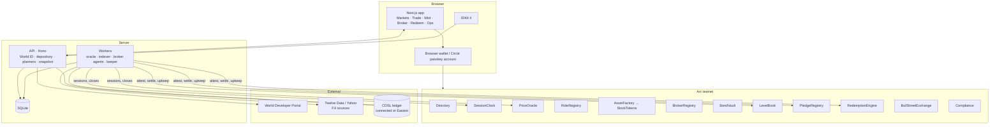
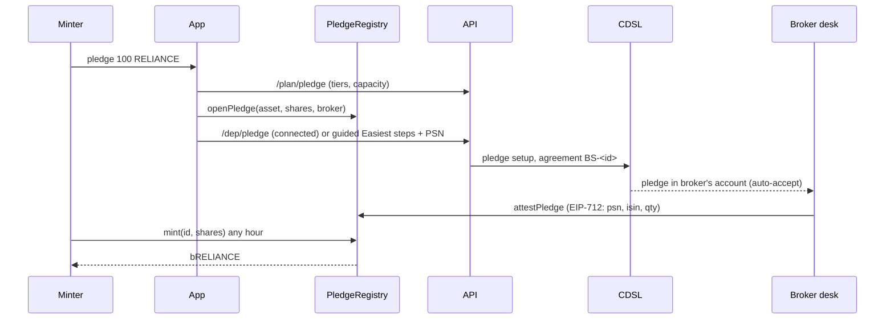
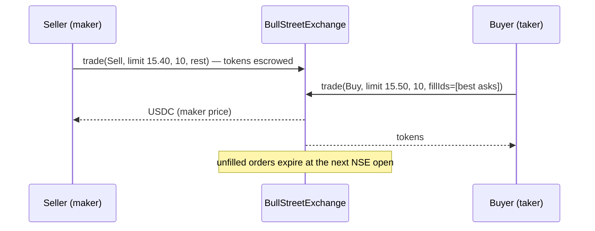
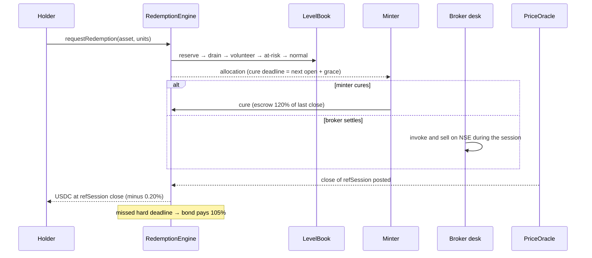

# Architecture

## Components

```mermaid
flowchart TB
  subgraph Browser
    APP[Next.js app<br/>Markets · Trade · Mint · Broker · Redeem · Ops]
    W[Browser wallet / Circle passkey account]
    IDK[IDKit 4]
  end
  subgraph Server
    API[API · Hono<br/>World ID · depository · planners · snapshot]
    WK[Workers<br/>oracle · indexer · broker agents · keeper]
    DB[(SQLite)]
  end
  subgraph External
    WORLD[World Developer Portal]
    TD[Twelve Data / Yahoo<br/>FX sources]
    CDSL[(CDSL ledger<br/>connected or Easiest)]
  end
  subgraph Arc[Arc testnet]
    DIR[Directory]
    SC[SessionClock]
    PO[PriceOracle]
    RR[RoleRegistry]
    AF[AssetFactory → StockTokens]
    BR[BrokerRegistry]
    BV[BondVault]
    LB[LevelBook]
    PR[PledgeRegistry]
    RE[RedemptionEngine]
    EX[BullStreetExchange]
    CO[Compliance]
  end
  APP <--> API
  APP --> W --> Arc
  IDK --> API --> WORLD
  API --> DB
  WK --> DB
  WK --> TD
  WK -- sessions, closes --> SC & PO
  WK -- attest, settle, upkeep --> PR & RE & LB
  API --- CDSL
  WK --- CDSL
```

## Pledge and mint

```mermaid
sequenceDiagram
  participant M as Minter
  participant App
  participant PR as PledgeRegistry
  participant API
  participant CDSL
  participant B as Broker desk
  M->>App: pledge 100 RELIANCE
  App->>API: /plan/pledge (tiers, capacity)
  App->>PR: openPledge(asset, shares, broker)
  App->>API: /dep/pledge (connected) or guided Easiest steps + PSN
  API->>CDSL: pledge setup, agreement BS-<id>
  CDSL-->>B: pledge in broker's account (auto-accept)
  B->>PR: attestPledge (EIP-712: psn, isin, qty)
  M->>PR: mint(id, shares) any hour
  PR-->>M: bRELIANCE
```

## Trade

```mermaid
sequenceDiagram
  participant S as Seller (maker)
  participant EX as BullStreetExchange
  participant T as Buyer (taker)
  S->>EX: trade(Sell, limit 15.40, 10, rest) — tokens escrowed
  T->>EX: trade(Buy, limit 15.50, 10, fillIds=[best asks])
  EX-->>S: USDC (maker price)
  EX-->>T: tokens
  Note over EX: unfilled orders expire at the next NSE open
```

## Redeem

```mermaid
sequenceDiagram
  participant H as Holder
  participant RE as RedemptionEngine
  participant LB as LevelBook
  participant M as Minter
  participant B as Broker desk
  participant PO as PriceOracle
  H->>RE: requestRedemption(asset, units)
  RE->>LB: reserve → drain → volunteer → at-risk → normal
  RE-->>M: allocation (cure deadline = next open + grace)
  alt minter cures
    M->>RE: cure (escrow 120% of last close)
  else broker settles
    B->>B: invoke and sell on NSE during the session
  end
  PO-->>RE: close of refSession posted
  RE-->>H: USDC at refSession close (minus 0.20%)
  Note over RE: missed hard deadline → bond pays 105%
```
